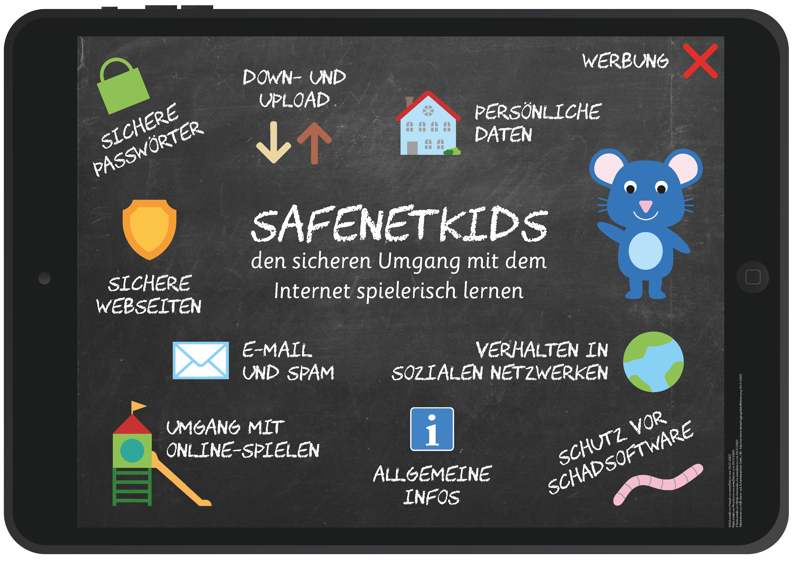

# SafeNetKids

SafeNetKids is a 2D serious game designed to teach primary school children about responsible and safe internet use.

## 📸 Showcase

More videos can be found here: https://drive.google.com/drive/folders/1_bnacW6YqwMBgzHCyXFy-EMT6nEHbQPH?usp=sharing

## Summary
The goal of the game is to improve children's media literacy by introducing them to potential dangers of the internet in a playful way. Topics include emails, social networks and malware.

The project was initially developed as part of my Bachelor's thesis in the summer semester of 2018 and was further continued as a collaborative project by me and several other students during my Master's degree in the winter semester of 2019.

## 🛠 Tech Stack
Corona Labs/Solar2D, Lua, Adobe Illustrator & Photoshop

## My Tasks
- Game design
- Front-end and game programming
- Creation of assets including illustrations and animations

### 🎮 Game Design
The main menu is designed as a small village, with each building representing a different topic. For example, the post office represents the topic of email. A cute mouse avatar guides the player through the game and introduces each topic before the player applies the newly learned knowledge in small games and quizzes.

Players earn points based on their response accuracy and completion time. The topics follow a predefined sequence, with new areas being unlocked after achieving a certain number of points in previous areas. This progression ensures that players acquire a basic understanding of each topic before moving on.

## Posters
   

